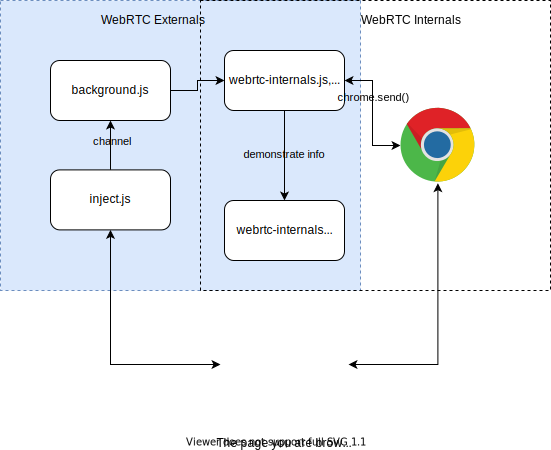

# Sprint 4

In sprint 4, 

1. We researched how to utilize WebRTC Externals to make our extension;
2. Developed the first version of our extension.

## WebRTC Externals

- Why we don't use WebRTC Internals

  WebRTC Internals calls `chrome.send()` method, which is not allowed in extension development, to get access to the page that may run WebRTC.

- How WebRTC Externals works

  - Inject.js: It injects and runs a script to every page the user opens. In the script, it overrides the default `RTCPeerConnection` method and add event listener to it. When it detects the usage of WebRTC, it posts message to the channel.
  - Background.js: It listens to the channel. When it receives message and data, it calls functions from webrtc-internals.js. And with the help of these functions, the background.html displays information we want.

- Approaches to utilize WebRTC Externals

  - In the process of posting message: 

    - When inject.js post a message to the channel, we call our function to pop up a window.
    - Problem: for web page that runs WebRTC, it posts message every second. 

  - In the process of displaying content:

    When webrtc-internals.js adds some particular contents to the background page, we pop up a window.

## Demo

Will be shown in class.

## Sprint 5
1. Add details to the pop-up window. Alert users to the risk of WebRTC leakage. Like giving away their real IPs.
2. Add another option for users to open our extension. Now, our extension has to be opened by clicking the icon. We will add a new option. If the user selects this option, our plug-in will automatically run in the background when they open a new browser. This feature will open another new TAB automatically.
3. Add unit tests
4. Add block feature to block WebRTC on the current website if time allowed.
