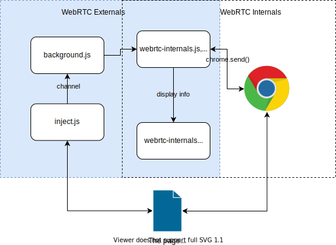

# Sprint 4

## Demo

Will be shown in class.

## Goal for Sprint 5

1. add details to the pop-up window. Alert users to the risk of WebRTC leakage. Like giving away their real IPs.
2. Add another option for user to open our extension. Now, our extension has to be opened by clicking the icon. We will add a new option. If the user selects this option, our plug-in will automatically run in the background when they open a new browser, which means opening another new TAB automatically.
3. Add block feature to block WebRTC on the current website if time allowed.