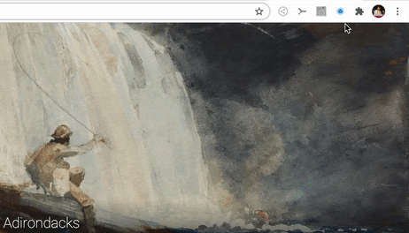

# WebRTC Cybersecurity, Sprint 1

Lin Cheng, Wenqiang Yang (EC601, A2, Group 1)

---

[toc]

## I. Product Mission

**Product Name:** WebRTC Notifier

**Product Category:** Chrome extension

**Main Idea:** Some websites secretly run "unnecessary" WebRTC services in the background, our product will protect user's right to know about WebRTC, and give them further options to block all WebRTC services, or some of WebRTC function modules.

**Basic Functions:** when the user opens a website that uses WebRTC technology in the background, the extension will prompt a box and notify the user; block some of the WebRTC functions for the current site.

**Target Customer:** people whose right to know about WebRTC is harmed; developers. Elaborations see in "III.User Story".

## II. Literature Review and Product Analysis

### i. WebRTC can Leak User's IP Address

To establish a direct connection with peer users, WebRTC use ICE protocol to gather user's IP addresses and ports as candidates, which is visible to the web application (using simple JavaScript). According to IETF's document concerning WebRTC IP address handling, there mainly three kinds of IP that may be leaked^[1]^:

1. If the client is behind a NAT, the client's private IP address and port will be collected;
2. If the client is multi-homed, the additional public IP addresses for the client can be learned, for example, if the user is using a "split-tunnel" VPN, WebRTC will not only collect the public IP address of the VPN, but also the ISP public address;
3. If the client is behind a proxy which does not handle all network requests, WebRTC will bypass the proxy, and collect the public IP address.

Some advertising platform and companies employ this vulnerability to build a browser fingerprinting for users without using cookies. Companies and advertising platforms use this to track user behaviors, or to distinguish human users from robots. 

In 2015, nytimes.com was reported to embed third-party WebRTC to scan visitors' local IP addresses^[2]^.

Our group also found that CSDN, one of the biggest technology sharing and technology blogging platform in China, also secretly runs some WebRTC functions when users are browsing plain articles.

### ii. Similar Product Analysis

There are many WebRTC-related Chrome extensions in the Chrome Web Store. We analyzed their functions and compared their advantages and disadvantages. Take two of them as an example.

1. WebRTC Network Limiter

   WebRTC Network Limiter, offered by www.webrtc.org,  helps users to prevent IP leakage. It can configure the WebRTC traffic routing options in Chrome's privacy settings, and can also configure WebRTC to not use certain IP addresses or protocols.^[3]^

2. WebRTC Control

   WebRTC Control, offered by Grephy, can block some of the WebRTC functions, such as RTCPeerConnection and RTCDataChannel, and even block media devices for WebRTC. It can also protect user's IP address by giving users options to select WebRTC's IP handling policy. ^[4]^

Like these two extensions, current WebRTC extensions doesn't notify the users if some website is running WebRTC in the background. Some of them can block WebRTC functions, but if WebRTC is blocked, a lot websites with WebRTC, like Google Hangout can't be used. It can be annoying if users have to activate and deactivate the extension frequently if they only want to block WebRTC services for some websites.

Another "product" we analyze is the Chrome built-in function, chrome://webrtc-internals. From this website, users can know if some WebRTC services are running in the browser, but it also has two disadvantages. First, It's inconvenient to open another tab or window to monitor the WebRTC activity. Also, people who are unfamiliar with WebRTC probably will not know this function.

## III. User Story and MVP

### i. User Story

1. As a developer who knows WebRTC, I want to know if some websites, especially websites that not necessarily need to run WebRTC, like NYT and CSDN we mentioned above, is running WebRTC services, and I prefer ways that are more convenient than opening chrome://webrtc-internals. 
2. As a user who cares about privacy, I hope my IP address will not be leaked, and I don't want my behavior on the Internet being tracked by advertisement platforms. I want to know if some website is running WebRTC, so I can take a further step, to block WebRTC (it will be ideal if I can block WebRTC for this website only), or stop browsing this website.

### ii. MVP

After prioritizing the user stories, the Minimum Valuable Product is a Chrome extension which sends users a notification once they are visiting a website that uses WebRTC.

## IV. Technology and Why we choose them

Both of us have no experience in developing Chrome extension, so we searched on the Internet about what technology can be used for Chrome extension development. We read the document provided by Google, and learn about the necessary technologies for extension development, and then we searched in the GitHub to find useful tools.

### i. HTML, CSS and JavaScript

Chrome extensions, similar to web development, are developed with HEML, CSS and JavaScript. Each Chrome extensions can be devided to functional pieces and some web pages. 

A Chrome extension usually includes a JSON file `manifest.json`, two web pages, `options` page, and `popup` page.

- `manifest.json` is like index for web application, it nominates basic descriptions of this extension, and it also tells browser what functions it implements and which JavaScript file works for each functions.

- `options` page allows users to customise their extension. Take WebRTC Network Limiter as an example, in the `options` page, it allow users to decide which IP handling policy they want. 

- `popup` page is the special window which appears when users click the extension icon

### ii. Webpack and React

Webpack and React are front-end development tools that can make the development much more easier and efficient.

Webpack is a module bundler. It allows developers to write their application in a modular programming way. Webpack will transform thes module to static assets, which can run in browsers.

With React, we can write separate components with props to form a complex application, and we can also create interactive UI more easily.^[5]^

## V. Setup of Development Environment

We followed the instructions of A GitHub repository, Chrome Extension Webpack Boilerplate, and finished the setup of environment. Fig. 1 shows that the demo extension functions well.

	
  

    Fig. 1 demo
  

## Reference

[1] Uberti, J., "WebRTC IP Address Handling Requirements", *IETF*, July, 2019, https://tools.ietf.org/html/draft-ietf-rtcweb-ip-handling-12

[2] incloud, "WebRTC being used now by embedded 3rd party on http://nytimes.com  to report visitors' local IP addresses", *Twitter*, July 2015, https://twitter.com/incloud/status/619624021123010560 (Accessed: 21 September 2020)

[3] WebRTC Network Limiter, https://chrome.google.com/webstore/detail/webrtc-network-limiter/npeicpdbkakmehahjeeohfdhnlpdklia

[4] WebRTC Control, https://chrome.google.com/webstore/detail/webrtc-control/fjkmabmdepjfammlpliljpnbhleegehm

[5] React, https://reactjs.org/

[6] Chrome Extension Webpack Boilerplate, https://github.com/samuelsimoes/chrome-extension-webpack-boilerplate