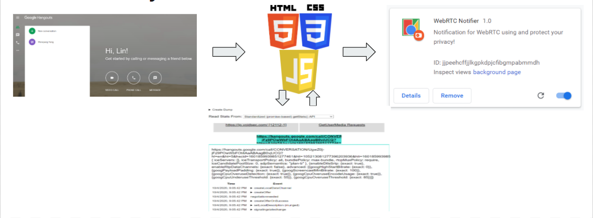
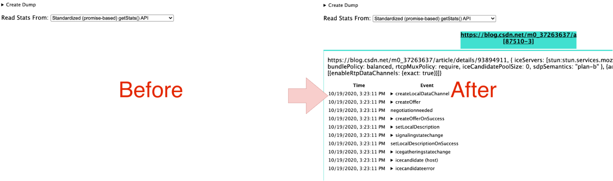

# WebRTC & Cybersecurity Project Sprint 02
**Author Name:** Lin Cheng, Wenqiang Yang\
**Due Date:** 10/19/2020\
**Project Name:** WebRTC & Cybersecurity Project Sprint 02

## 1. Description
This is a description for EC601 WebRTC Cybersecurity Project Sprint 02. The expectation of this sprint:
1. Definition of architecture
2. Functional demonstration of major user story
3. Technology Selection and justification

## 2. Architecture

The basic structure of our product can be divided into four parts: the user behavior part, the code part, the Google WebRTC-internals part, and the "WebRTC Notifier" plug-in part.

For the code part, our current idea is to divide it into four components: the listening component, the analysis component, the interaction component and the interface component(or UI component).

### 2.1 The Listening Component
First the user needs to install and turn on our "WebRTC Notifier" plug-in. 
Then, the listening part of our code begins to execute. It will collect the URLs of all the opening sites and save them in a list.

### 2.2 The Analysis Component
The analysis part will create the connection between Google's built-in WebRTC-internals website and our product. It sends the list of saved sites to the WebRTC-internals website and analyzes the results. This section will then return all results if Google's built-in monitoring system detects that the current URL wants to use WebRTC. 

### 2.3 The Interaction Component
The interactive section takes the results collecting from the WebRTC-internals site and passes them to our Google extension application. The extension will then pop up a window telling the user that the current site wants to use your WebRTC. Users can then choose to continue browsing the site or exit.

### 2.4 The Interface Component
The interface part(or UI part) is the design part of the entire plug-in interface.

## 3. Functional Demonstration of Major User Story

A very simple user story might happen when using Google Hangouts. When the user wants to use the voice or video calls with others in the Google Hangouts, our product will first send the URL to Google's WebRTC-internals website, if the monitoring system detects that the current url is using WebRTC, all the results from the monitoring system will be collected and passed to our application, then the user will see a popup window that shows “The current website will use your WebRTC data.” At the end, the user can choose to continue the video chat or exit the current site.

## 4. Technology Selection

The crucial part of our project is the analysis part, that is, to analyze if some web page is running WebRTC service. From another perspective, if we know the difference between a "normal" website from a website running with WebRTC, we can know if some website is running WebRTC. Also, we can learn from current tools, such as chrome://webrtc-internals and [WebRTC Leak Prevent](https://github.com/aghorler/WebRTC-Leak-Prevent). Based on these inspirations, we came up with some possible solutions. 

### 4.1 Embed JavaScript Code

Comparing with "normal" website, website running WebRTC service include script using WebRTC API.

WebRTC JavaScript API usually contains three collections of APIs, `getUserMedia`, `RTCPeerConnection`, and `RTCDataChannel`, which respectively represents getting access to media services, signaling and direct data transmission. 

However, not all APIs are used, for example, [tencent sports livestream](sports.qq.com) does not uses `getUserMedia` API, and [IP Leakage Detection](ip.voidse.com), [CSDN Blogs](blog.csdn.net) does not use both `getUserMedia` and `RTCDataChannel` API. Only `RTCPeerConnection` API is essential to create WebRTC service. So we can differentiate WebRTC website from other websites by detecting if this website uses `RTCPeerConnection`. To be specific, we can detect if this website executes script that creates a `RTCPeerConnection` instance or uses methods like `createOffer()`.

While learning Chrome Extension development in sprint1, we learned that we can run `content scripts` in the context of webpage visited, and can read details of the webpage and pass information back to the father extension.[1] It seems make it possible to detect the website JavaScripts.

After some research, we realized that simply embedding some content scripts will not work because of three obstacles:
1. Content scripts are run "in an isolated world"[1], which means content scripts cannot access variables nor functions from the website script. 
2. If the WebRTC-related instances and methods are not global, and only functions in a certain scope, our embeded code cannot interact with them.
3. If the website JavaScript code is obfuscated, it will be really hard to parse the code and analyze it.

### 4.2 Monitor Network Behavior

Another big difference between website running WebRTC and other websites is network behavior. WebRTC technology create direct peer-to-peer connection for clients using UDP by default. In the signaling, it might also behave differently. It sends session description information to remote server and also communicate with ICE servers (STUN and TURN servers).

Like the previous part, the peer-to-peer connection is not necessarily established, and what we can analyze is the network behavior while signaling. We are still researching the feasibility of monitoring network behavior.

### 4.3 Webrtc-internals

From the previous study, we already knew that there is a Chrome built-in tool, chrome://webrtc-internals, which will presents statistics about WebRTC usage in the current browser. 

#### 4.3.1 Simulate Visiting and Monitor

Webrtc-internals page changes in real time. When WebRTC starts to run, it presents statistics immediately, and vice versa. So if we can interact with webrtc-internals, and get information from it, we can know if some website runs WebRTC. We didn't find direct access to webrtc-internals, so we considered about simulating visiting it in the background and monitoring its change. One direct change is its UI change, some HTML elements was appended and removed when WebRTC starts and terminates.

We found another Chrome extension, [Distill](https://distill.io/), which can monitor HTML elements changes. But Distill does not support monitoring Chrome built-in web pages, because it runs in the cloud. We will verify if we can monitor webrtc-internals in some way, locally, in the further research.

#### 4.3.2 Learn from JavaScript Implementation

Webrtc-internals is a WebUI in Chrome. Like normal web pages, it is implemented with web technologies such as HTML, CSS and JavaScript. We analyzed its JavaScript implementation. We found that it uses `chrome.send()` method to get messages from the browser, which can only be used by WebUI (those whose "URL" starts from "chrome://".)[2]

### 4.4 Other Solutions

We also analyzed another extension, [WebRTC Leak Prevent](https://github.com/aghorler/WebRTC-Leak-Prevent). It is an open source Chrome extension that prevents IP leak caused by WebRTC. This extension uses a Chrome extension API that controls WebRTC privacy settings, and does not detect WebRTC service.

Another possible solution is maintaining a list of websites that uses WebRTC in our database, and check if current website matches URL on the list. It probably works but has an obvious disadvantage. It cannot detect websites outside the list and information may be outdated if the list is not updated frequently.

### 4.5 Further Research

At the beginning of sprint 3, we will continue to research for possible solution for our problem. 

Firstly, we will dive deep in network monitoring. We will check the APIs provided for Chrome extension concerning network.

Secondly, we will verify if we can interact with webrtc-internals in another way, or if we can simulate visiting webrtc-internals in the background. 

## Reference
[1] Google, "Content Scripts", https://developer.chrome.com/extensions/content_scripts (Accessed: 18 October 2020)

[2] Google, "WebUI Explainer", https://chromium.googlesource.com/chromium/src/+/master/docs/webui_explainer.md (Accessed: 18 October 2020)

